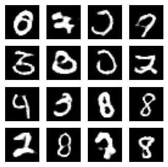

# MNIST Digit Generation using DCGAN

This is a project for generating MNIST digit images using a Deep Convolutional Generative Adversarial Network (DCGAN). DCGAN is a type of generative model that can create realistic images from random noise. In this project, we will use TensorFlow to implement and train the DCGAN model for generating digit images.

## Prerequisites

Before running the code, ensure you have the following prerequisites:

- TensorFlow
- NumPy
- Matplotlib
- ImageIO
- IPython
- Python 3.x
- GPU (optional but recommended for faster training)

## Getting Started

Follow these steps to get started with the project:

1. Clone the repository or download the code file.
2. Install the required dependencies using `pip install tensorflow numpy matplotlib imageio ipython` or `pip install -r requirements.txt`.
3. Run the code in your Python environment. Make sure you have a compatible GPU for faster training, as the code is set to utilize GPU if available.

## Dataset

This project uses the MNIST dataset, which consists of hand-written digit images. The dataset is automatically loaded and prepared in the code.

## Training

The training loop is defined in the `train` function in the code. The code will train the DCGAN for a specified number of epochs, generating and saving images after each epoch.

## Checkpoints

Model checkpoints are saved in the `training_checkpoints` directory. You can use these checkpoints to resume training or generate images using a pre-trained model.

## Generating Images

The code also includes functions for generating and saving images using the trained generator model. These images are stored in the `images/` directory.

## Creating a GIF

You can create a GIF to visualize the generator's progress over epochs. The code includes a function for generating a GIF from the saved images.

## Visualizing Losses

The code also provides a way to visualize the losses of the generator and discriminator over the training epochs. The losses can help you assess if the model is converging properly.

## Saving the Model

The trained generator and discriminator models can be saved for later use using `generator.save('generator.h5')` and `discriminator.save('discriminator.h5')`.

Feel free to modify the code or experiment with different parameters to generate various digit images using DCGAN.

Enjoy generating MNIST digit images with your DCGAN model!